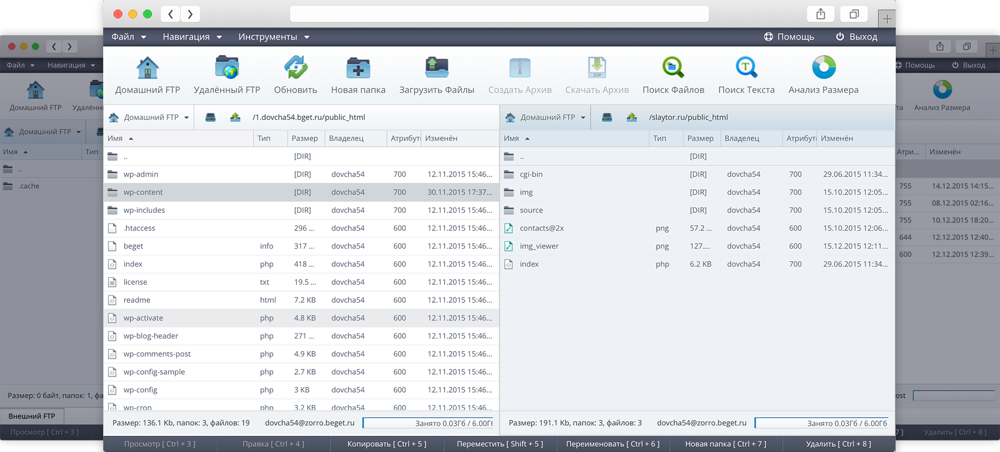

[](https://travis-ci.org/LTD-Beget/sprutio)

## Sprut.io Open Source File Manager

### Сайт проекта:
 * https://sprut.io/ru

### Возможности:

 * Классический и привычный двухпанельный интерфейс позволит легко и удобно работать с несколькими серверами и перетаскивать файл туда и обратно. 
 * Удобный редактор с подсветкой синтаксиса можно легко настроить на свой вкус. Редактор имеет функцию автодополнения и встроенный плагин Emmet, значительно облегчающий работу с HTML и CSS. 
 * Поиск по файлам и папкам. Файловый менеджер поддерживает быстрый поиск нужных файлов по директориям, а также поиска текста по содержимому файлов. 
 * Для быстрой работы с файловым менеджером он имеет ряд горячих комбинаций для популярных действий, таких как: копирование, перемещение, просмотр файлов и т.д. 
 * Для просмотра графических файлов файловый менеджер содержит встроенный просмотрщик изображений. Вы можете перевернуть изображение, изменить его масштаб и перейти к следующему изображению. 

### Демо
 * https://demo.sprut.io:9443
 * login:    demo
 * password: demo
 
### Требования
 * Docker [(install guide)](https://docs.docker.com/engine/installation/)
 * Свободно более 1,5 гигабайт дискового пространства
 
После установки всех необходимых компонентов

1) Скачайте инсталятор

```*.sh
user@host:~$ wget https://raw.githubusercontent.com/LTD-Beget/sprutio/master/run.sh
```

2) Назначьте ему права на выполение

```*.sh
user@host:~$ chmod +x run.sh
```

3) Запустите скрипт

```*.sh
user@host:~$ ./run.sh
```

Скрипт будет работать в среднем 10-15 минут, за это время можно насладиться вкусным чаем.

После скачивания и запуска Docker контейнеров, работу системы можно проверить командой:

```*.sh
user@host:~$ docker ps

CONTAINER ID   IMAGE                  COMMAND                    NAMES
57cc6c3c2e2b   beget/sprutio-nginx    "nginx -g 'daemon off"     sprutio_nginx_1
3fbc26a6ecc1   beget/sprutio-app      "/init"                    sprutio_app_1
d6d539b09e5a   beget/sprutio-rpc      "/init"                    sprutio_rpc_1
41b22463e99a   beget/sprutio-cron     "/init"                    sprutio_cron_1
2ea18de7d54b   redis:3.0              "/entrypoint.sh redis"     sprutio_redis_
```


Sprut.io будет будет доступен по протоколу HTTPS на IP адресе Вашего сервера:

```*.sh
user@host:~$ https://YOUR_SERVER_IP:9443
```

Для входа можно использовать любого пользователя в системе на которую установлен Sprut.io

Файловый менеджер будет использовать самоподписанный SSL сертификат, для использования другово сертифика поместите его в директорию "SSL"

### Дополнительные материалы
 * статья о Sprut.IO на  [habrahabr](https://habrahabr.ru/company/beget/blog/277449/)
 * статья о Sprut.IO в журнале [LinuxFormat](http://shop.linuxformat.ru/lxf_208/) от [апреля](promo/linuxformat_mainpage.jpg) 2016 года, [cкрин статьи](promo/linuxformat.png)
 
### Скриншот файлового менеджера




Sprut.io Team.
